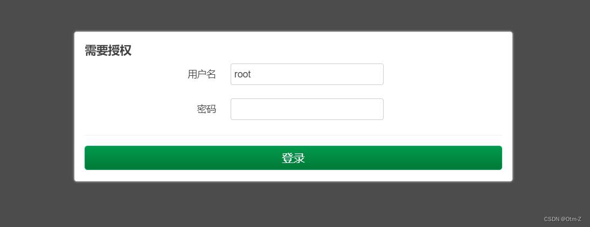
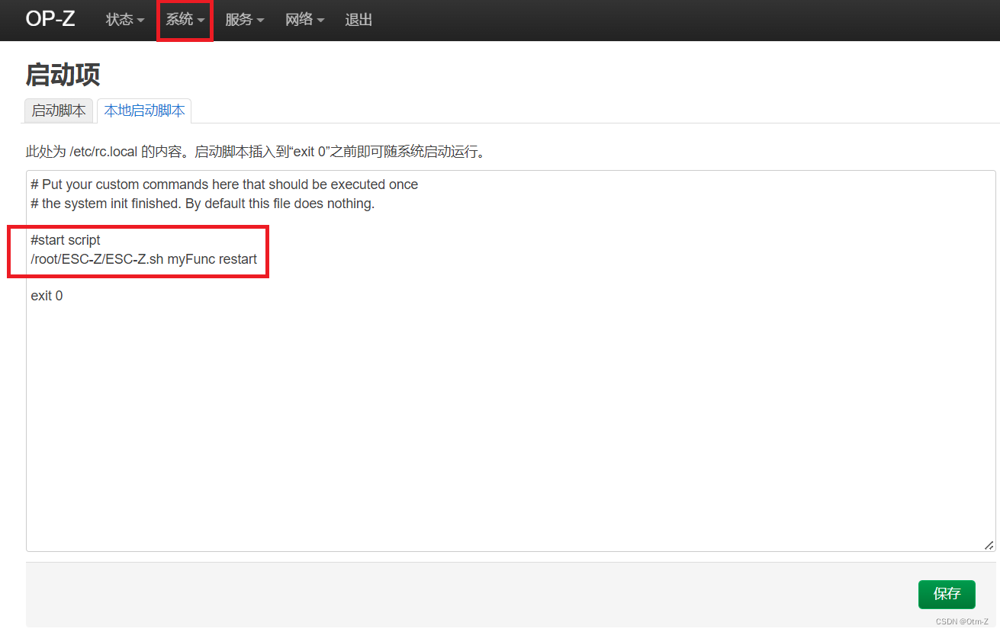
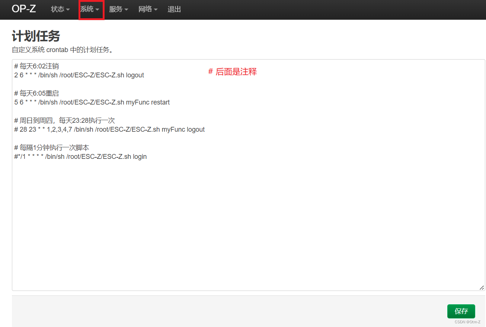
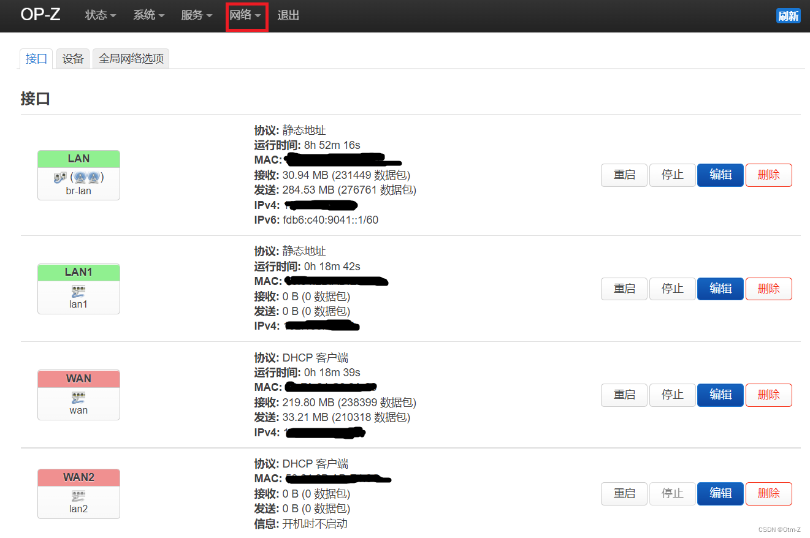
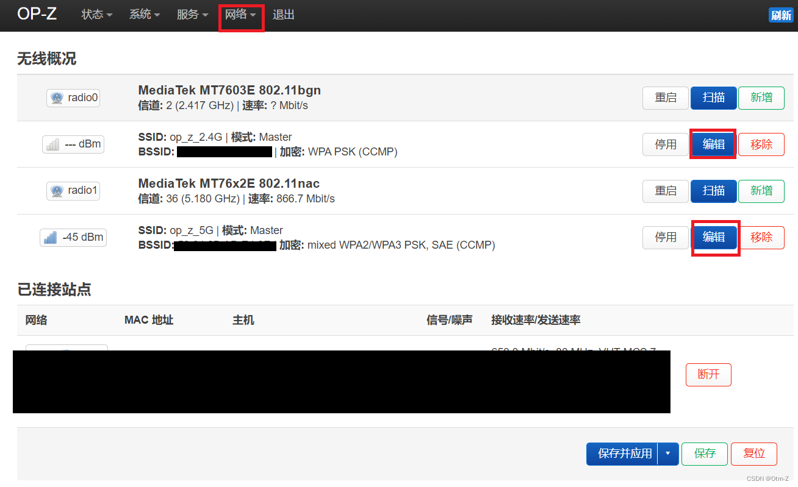
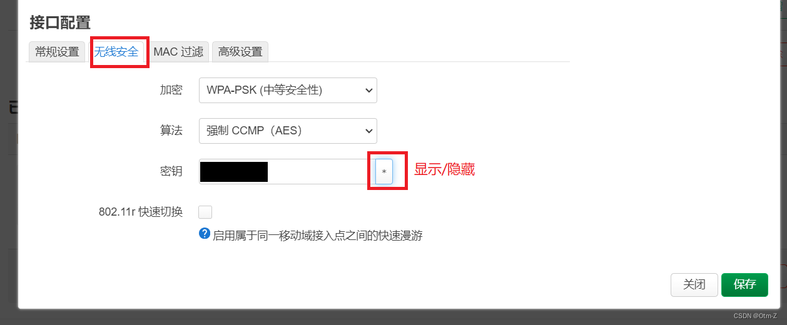
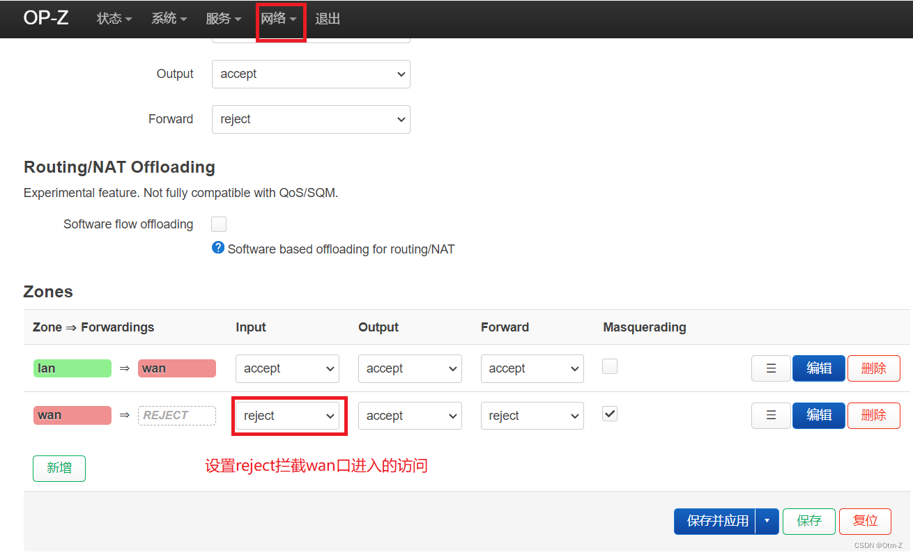
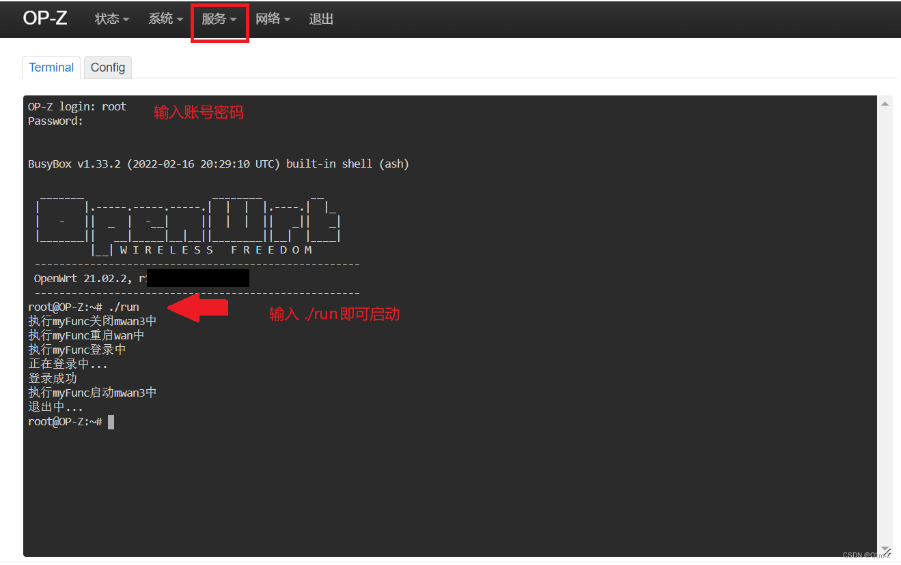

# Openwrt 菜单
## 1. 登录
浏览器输入 **http://openwrt/** 中（openwrt已映射到192.168.1.1），可以打开以下页面，直接输入密码即可（默认用户root）


## 2. 启动项
在 **系统 - 启动项 - 本地启动脚本** 中，写了一条启动登录校园网的脚本，用于每次设备启动时随系统启动运行。

注：`/... myFunc restart` 参数是自定义函数，需要先写好逻辑代码才能运行，详情见 [ESC-MWAN 使用建议](https://github.com/Z446C/ESC-MWAN#%E4%BD%BF%E7%94%A8%E7%9A%84%E5%BB%BA%E8%AE%AE)

## 3. 计划任务
在 **系统 - 计划任务** 中，可以根据规则在规定的时间执行命令，其中用到的语法是[cron](https://baike.baidu.com/item/cron/10952601)，可以用[Cron在线表达式生成器](http://cron.ciding.cc/)来生成表达式。


## 4. 接口
在 **网络 - 接口** 中，可以查看路由器设备接口的详情信息。配置两个wan口以上，才能使用ESC-MWAN


## 5. 无线
在 **网络 - 接口** 中，可以查看WIFI的详情信息，点击编辑可以设置WiFi的密码等。



## 6. 网络防火墙
在 **网络 - 防火墙** 中，可以设置lan、wan的访问规则。这里设置`wan -> input`为`accept`可以从wan口访问路由器（例如面板，ssh等），为了安全性考虑可以设置`reject`


## 7. 终端
在 **网络 - 防火墙** 中，可以在web中运行shell脚本。（插件包：luci-app-ttyd）

注： `./run`是一个shell脚本，内容如下
```bash
/root/ESC-MWAN/ESC-MWAN.sh login
```
